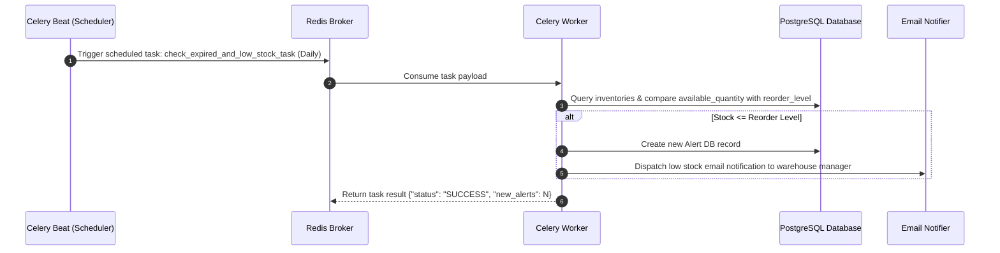

# Celery Workflow Diagram

```mermaid
sequenceDiagram
    autonumber
    participant Beat as Celery Beat (Scheduler)
    participant Redis as Redis Broker
    participant Worker as Celery Worker
    participant DB as PostgreSQL Database
    participant Email as Email Notifier

    Beat->>Redis: Trigger scheduled task: check_expired_and_low_stock_task (Daily)
    Redis->>Worker: Consume task payload
    Worker->>DB: Query inventories & compare available_quantity with reorder_level
    alt Stock <= Reorder Level
        Worker->>DB: Create new Alert DB record
        Worker->>Email: Dispatch low stock email notification to warehouse manager
    end
    Worker-->>Redis: Return task result {"status": "SUCCESS", "new_alerts": N}
```
