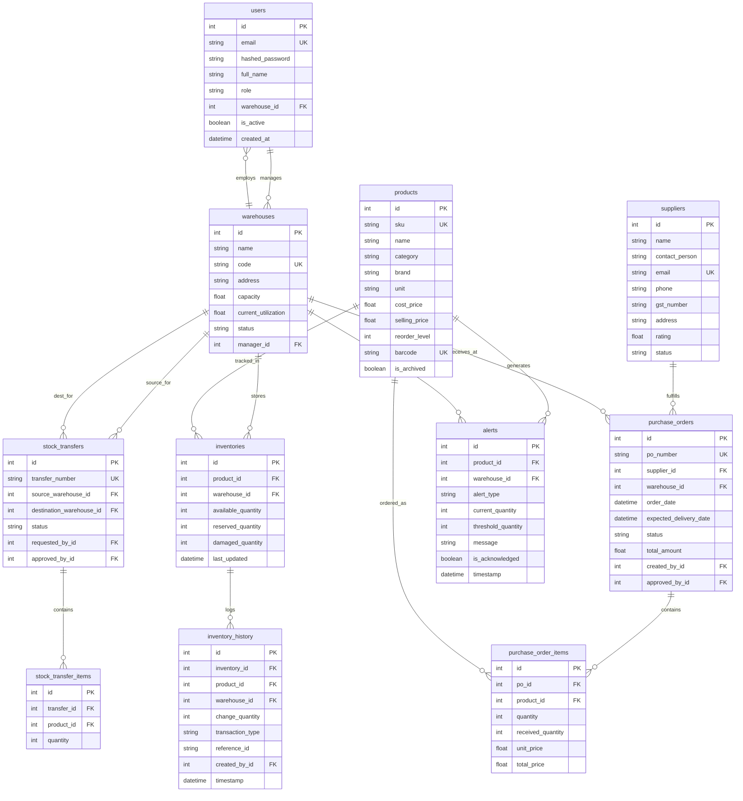

# Database Schema Diagram

```mermaid
erDiagram
    users {
        int id PK
        string email UK
        string hashed_password
        string full_name
        string role
        int warehouse_id FK
        boolean is_active
        datetime created_at
    }

    warehouses {
        int id PK
        string name
        string code UK
        string address
        float capacity
        float current_utilization
        string status
        int manager_id FK
    }

    suppliers {
        int id PK
        string name
        string contact_person
        string email UK
        string phone
        string gst_number
        string address
        float rating
        string status
    }

    products {
        int id PK
        string sku UK
        string name
        string category
        string brand
        string unit
        float cost_price
        float selling_price
        int reorder_level
        string barcode UK
        boolean is_archived
    }

    inventories {
        int id PK
        int product_id FK
        int warehouse_id FK
        int available_quantity
        int reserved_quantity
        int damaged_quantity
        datetime last_updated
    }

    inventory_history {
        int id PK
        int inventory_id FK
        int product_id FK
        int warehouse_id FK
        int change_quantity
        string transaction_type
        string reference_id
        int created_by_id FK
        datetime timestamp
    }

    purchase_orders {
        int id PK
        string po_number UK
        int supplier_id FK
        int warehouse_id FK
        datetime order_date
        datetime expected_delivery_date
        string status
        float total_amount
        int created_by_id FK
        int approved_by_id FK
    }

    purchase_order_items {
        int id PK
        int po_id FK
        int product_id FK
        int quantity
        int received_quantity
        float unit_price
        float total_price
    }

    stock_transfers {
        int id PK
        string transfer_number UK
        int source_warehouse_id FK
        int destination_warehouse_id FK
        string status
        int requested_by_id FK
        int approved_by_id FK
    }

    stock_transfer_items {
        int id PK
        int transfer_id FK
        int product_id FK
        int quantity
    }

    alerts {
        int id PK
        int product_id FK
        int warehouse_id FK
        string alert_type
        int current_quantity
        int threshold_quantity
        string message
        boolean is_acknowledged
        datetime timestamp
    }

    users ||--o{ warehouses : manages
    warehouses ||--o{ users : employs
    warehouses ||--o{ inventories : stores
    products ||--o{ inventories : tracked_in
    inventories ||--o{ inventory_history : logs
    suppliers ||--o{ purchase_orders : fulfills
    warehouses ||--o{ purchase_orders : receives_at
    purchase_orders ||--o{ purchase_order_items : contains
    products ||--o{ purchase_order_items : ordered_as
    warehouses ||--o{ stock_transfers : source_for
    warehouses ||--o{ stock_transfers : dest_for
    stock_transfers ||--o{ stock_transfer_items : contains
    products ||--o{ alerts : generates
    warehouses ||--o{ alerts : located_at
```
