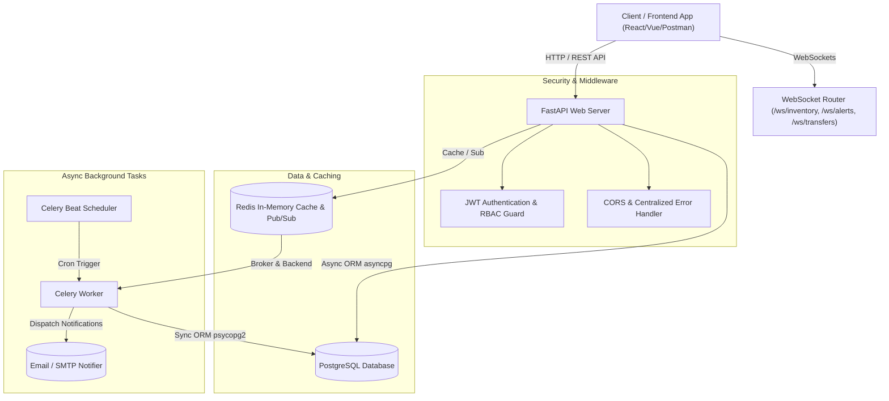

# System Architecture Diagram

```mermaid
graph TD
    Client["Client / Frontend App (React/Vue/Postman)"] -->|HTTP / REST API| FastAPI["FastAPI Web Server"]
    Client -->|WebSockets| WS["WebSocket Router (/ws/inventory, /ws/alerts, /ws/transfers)"]

    subgraph Security & Middleware
        FastAPI --> JWT["JWT Authentication & RBAC Guard"]
        FastAPI --> CORS["CORS & Centralized Error Handler"]
    end

    subgraph Data & Caching
        FastAPI -->|Async ORM asyncpg| Postgres[("PostgreSQL Database")]
        FastAPI -->|Cache / Sub| Redis[("Redis In-Memory Cache & Pub/Sub")]
    end

    subgraph Async Background Tasks
        Redis -->|Broker & Backend| CeleryWorker["Celery Worker"]
        CeleryBeat["Celery Beat Scheduler"] -->|Cron Trigger| CeleryWorker
        CeleryWorker -->|Sync ORM psycopg2| Postgres
        CeleryWorker -->|Dispatch Notifications| Email[("Email / SMTP Notifier")]
    end
```
