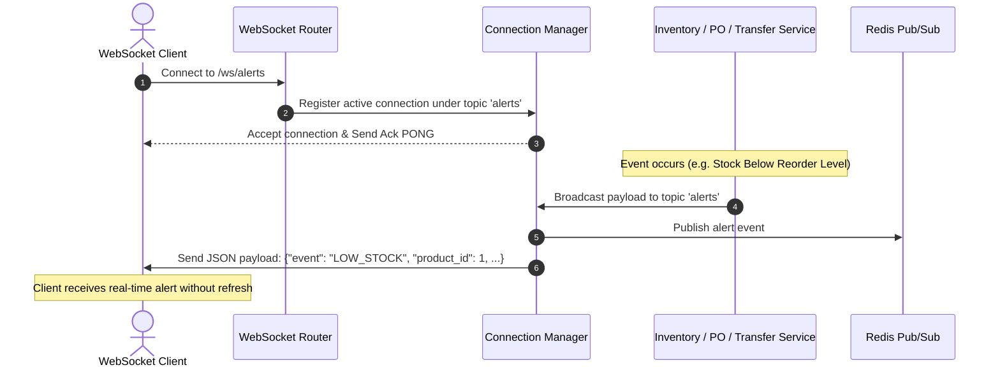

# WebSocket Flow Diagram

```mermaid
sequenceDiagram
    autonumber
    actor Client as WebSocket Client
    participant WS as WebSocket Router
    participant CM as Connection Manager
    participant App as Inventory / PO / Transfer Service
    participant Redis as Redis Pub/Sub

    Client->>WS: Connect to /ws/alerts
    WS->>CM: Register active connection under topic 'alerts'
    CM-->>Client: Accept connection & Send Ack PONG

    Note over App: Event occurs (e.g. Stock Below Reorder Level)
    App->>CM: Broadcast payload to topic 'alerts'
    CM->>Redis: Publish alert event
    CM->>Client: Send JSON payload: {"event": "LOW_STOCK", "product_id": 1, ...}

    Note over Client: Client receives real-time alert without refresh
```
